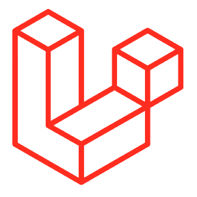
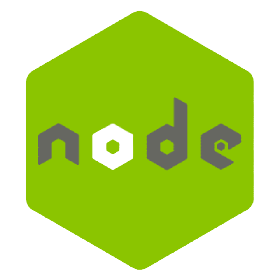

I am **Abdul Hadi** from Dhaka, Bangladesh. 🧔 

A passionate individual who loves building web applications, a programmer by passion, an engineer by profession. I have rich experience in **WordPress-based** web application development, also I am good at **React, Vue**.  I am currently working as a WordPress developer at **weDevs** 👨‍💻.
 
 
## ⚡ Technologies

    
    <table align="right">
        <tr>
            <td align="center" width="140" height="112.43">
                
                  PHP
            </td>
            <td align="center" width="140" height="112.43">
                
                  Javascript
            </td>
            <td align="center" width="140" height="112.43">
                
                  Python
            </td>
        </tr>
        <tr>
            <td align="center" width="140" height="112.43">
                
                  WordPress
            </td>
            <td align="center" width="140" height="112.43">
                
                  MySQL
            </td>
            <td align="center" width="140" height="112.43">
                
                  Vue
            </td>
        </tr>
    </table>

 

    <table align="left">
        <tr>
            <td align="center" width="140" height="112.43">
                
                  React
            </td>
            <td align="center" width="140" height="112.43">
                
                  Laravel
            </td>
            <td align="center" width="140" height="112.43">
                
                  Tailwind
            </td>
        </tr>
        <tr>
            <td align="center" width="140" height="112.43">
                
                  Postgresql
            </td>
            <td align="center" width="140" height="112.43">
                
                  Node
            </td>
            <td align="center" width="140" height="112.43">
                
                  Sass
            </td>
        </tr>
    </table>
    

 
 

## 👨‍💻 Currently I am working ...

    
    ... as a Junior Software Engineer in weDevs where I am working on designing & developing an internal web application to analyze, integrate, access, and visualize hop data.
     
     
    <strong>Tech Stack: </strong> PHP, WordPress, Javascript, VueJS, jQuery, MySQL etc
      
      

## 📈 Github Stats

